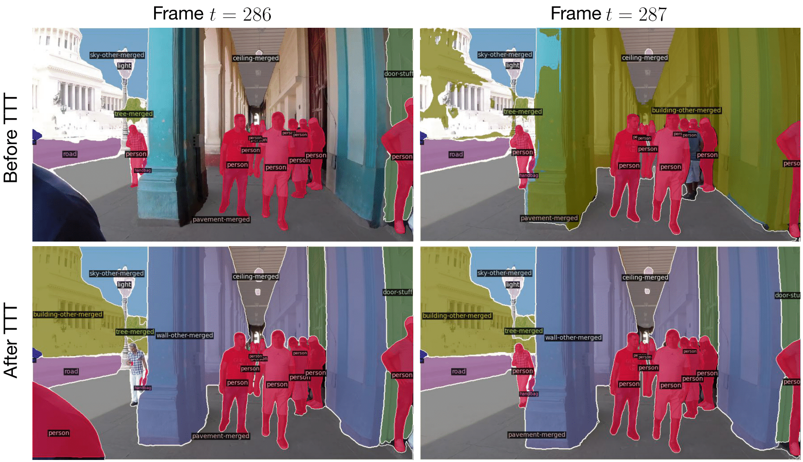

# Test-Time Training on Video Streams

[Renhao Wang*](https://renwang435.github.io/), [Yu Sun*](https://yueatsprograms.github.io/), [Yossi Gandelsman](https://yossigandelsman.github.io/), [Xinlei Chen](https://xinleic.xyz/), [Alexei A. Efros](http://people.eecs.berkeley.edu/~efros/), [Xiaolong Wang](https://xiaolonw.github.io/)

[[`arXiv`](https://arxiv.org/abs/2307.05014)] [[`Project`](https://video-ttt.github.io/)] [[`BibTeX`](#Citing)]

<div align="center">
    
</div>
<br>

## Installation
See [installation instructions](INSTALL.md).

## Datasets
We release COCO-Videos, a new dataset for instance and panoptic segmentation which follows the COCO labeling format. We also rely on semantic-level labels in the [KITTI-STEP](https://www.cvlibs.net/datasets/kitti/eval_step.php) dataset for evaluation on semantic segmentation.
<br>
All datasets can be [downloaded here](https://berkeley.box.com/s/8ieod46tjh4k2n1lyid6qhap9qsy947s) and should subsequently be unzipped to the path specified under the `$DETECTRON2_DATASETS` environment variable (see [installation instructions](INSTALL.md)).

## Checkpoints

Relevant pretrained checkpoints can be [obtained here](https://berkeley.box.com/s/ksy6bf90qqpshd70785v8v38btqdn0oa). These should be downloaded and stored at some `/path/to/checkpoints`.

## Reproducing Results

### Baselines
To evaluate a pretrained Mask2Former-S on COCO-Videos for instance segmentation:
```
python runner_coco_videos_baseline.py --gpu 0 \
  --videos bangkok bar berkeley havana house irvine paris restaurant school tokyo \
  --batch_size 8 \
  --weights /path/to/checkpoints/ttt_coco_panoptic_baseline.pkl \
  --output_dir coco_vid_panoptic_baseline \
  --eval_type pano \
  --num_imgs 4000
```
You can pass `--eval_type inst` to obtain the baseline instance numbers (as well as the corresponding pretrained instance segmentation checkpoint). Results will be logged under the directory specified in the `--output_dir` flag, 

### COCO-Videos Instance and Panoptic Segmentation

Runner script for instance segmentation:
```
python runner_ttt_mae_inst.py --gpu 0 \
    --videos bangkok bar berkeley havana house irvine paris restaurant school tokyo \
    --batch_size 32 \
    --accum_iter 8 \
    --base_lr 0.0001 \
    --weights /path/to/checkpoints/ttt_coco_instance_baseline.pkl \
    --restart_optimizer
```

Runner script for panoptic segmentation:
```
python runner_ttt_mae_panoptic.py --gpu 0 \
    --videos bangkok bar berkeley havana house irvine paris restaurant school tokyo \
    --batch_size 32 \
    --accum_iter 8 \
    --base_lr 0.0001 \
    --weights /path/to/checkpoints/ttt_coco_panoptic_baseline.pkl \
    --restart_optimizer
```

For easy collation of numbers, we provide a utility script which can, for example, be called as `python mask2former/utils/tabulate_results_cv.py --root_dir exp_dir/mae_coco_inst_32_0.0001`.

### KITTI-STEP Semantic Segmentation

Runner script:
```
python runner_ttt_mae.py --gpu 0 \
    --videos 0000 0001 0002 0003 0004 0005 0006 0007 0008 0009 0010 0011 0012 0013 0014 0015 0016 0017 0018 0019 0020 \
    --batch_size 32 \
    --accum_iter 4 \
    --base_lrs 0.0001 \
    --weights /path/to/checkpoints/ttt_ks_semantic_baseline.pkl \
    --restart_optimizer
```

For easy collation of numbers, we provide a utility script which can, for example, be called as `python mask2former/utils/tabulate_results.py --root_dir exp_dir/mae_ks_sema_32_0.0001`.

## License

This codebase inherits all licenses from the public release of [Mask2Former](https://github.com/facebookresearch/Mask2Former#license).


## <a name="Citing"></a>Citing Video-TTT

```BibTeX
@article{wang2023test,
  title={Test-Time Training on Video Streams},
  author={Wang, Renhao and Sun, Yu and Gandelsman, Yossi and Chen, Xinlei and Efros, Alexei A and Wang, Xiaolong},
  year={2023}
}
```

## Acknowledgements

Code is based on [Mask2Former](https://github.com/facebookresearch/Mask2Former).
